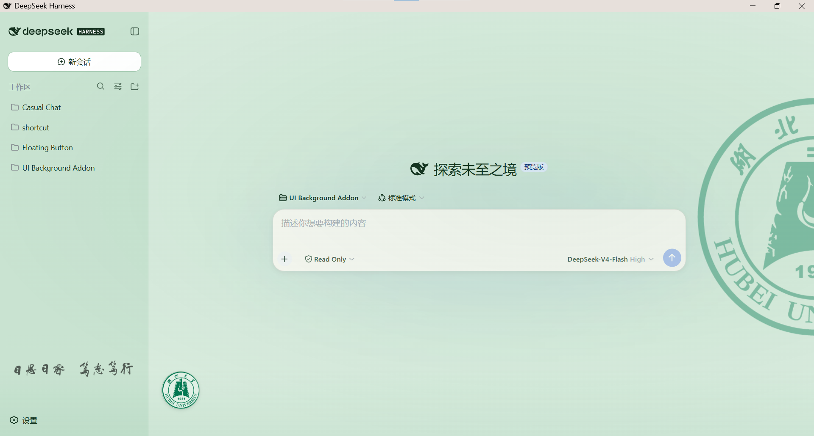
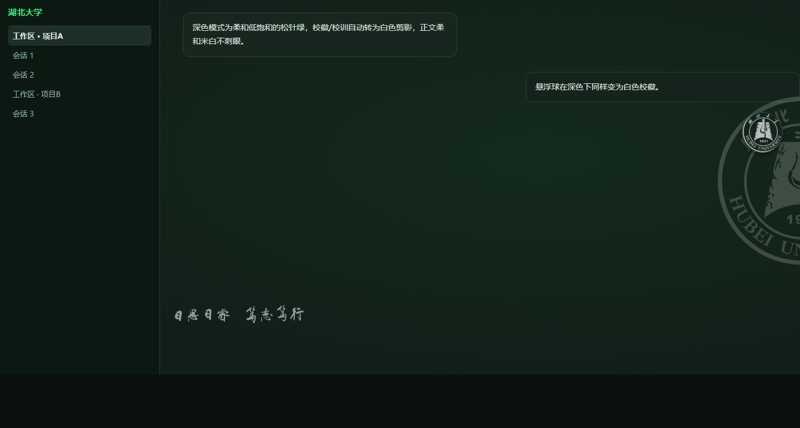

# DSH 湖北大学主题插件

为 DeepSeek Harness（DSH）Web UI 定制的一套**湖北大学主题**插件，包含两个持久化客户端插件：

- **背景主题**（`hubu-theme`）：护眼淡绿配色（浅色/深色自适应）+ 右侧校徽水印 + 底部校训横匾
- **校标悬浮球**（`hubu-floatball`）：可拖动的校标悬浮球，点击查看 DeepSeek 账户余额

> 插件为**持久化**（写进 profile 的 `cordis.patch.yml`），随 DSH 启动自动加载，重启不丢失。
>
> 🏷️ 仓库 Topics：`dsh` · `deepseek-harness` · `plugin` · `theme` · `deepseek` · `hubu` · `floating-ball` · `ui`

## 📸 效果预览

| 浅色模式 | 深色模式 |
| --- | --- |
|  |  |

> 预览图为界面示意（可打开 `preview/preview.html` 在线查看）。左侧为护眼淡绿浅色主题；右侧为柔和低饱和的松针绿深色主题，校徽/校训自动转为白色剪影。

---

## ✨ 特性

### 背景主题 `hubu-theme`

- **护眼淡绿配色**：浅色/深色模式各自独立配色（深色为柔和低饱和的松针绿系，非纯黑）
- **校徽水印**：右侧校徽（浅色原色 / 深色白色剪影）
- **校训横匾**：底部校训（浅色 60% / 深色白色 55%，宽度随侧边栏缩放）
- **平滑跟随动画**：校训尺寸与透明度逐帧跟随侧边栏收起/展开动画
- **校训防重合**：工作区文件夹列表下边界自动上移 14vh，文件再多也不会与校训重叠
- **主题实时感知**：通过 `theme/change` 事件切换深浅色样式

### 悬浮球 `hubu-floatball`

- **校标图标**悬浮球，可在工作区内自由拖动（位置记忆于 localStorage）
- **点击查看余额**：显示 DeepSeek 账户总余额与状态（1 秒限频）
- **高峰/空闲时段**显示（9:00–12:00 / 14:00–18:00 为高峰）
- **深色模式适配**：深色下校标自动变白色剪影（透明度 0.7），与背景校徽风格一致
- 跟随工作区：侧边栏展开/收回、窗口缩放时保持相对位置

---

## 📁 目录结构

```
DSH湖北大学主题插件/
├── cordis.patch.yml          # profile 补丁（含两个插件的加载项）
├── hubu-theme/               # 背景主题插件包
│   ├── package.json
│   └── lib/
│       ├── index.js          # 宿主侧入口（空 apply）
│       └── client.js         # 浏览器侧（含内嵌校徽/校训图片）
├── hubu-floatball/         # 悬浮球插件包
│   ├── package.json
│   └── lib/
│       ├── index.js          # 宿主侧（余额接口 /hubu/balance）
│       └── client.js         # 浏览器侧（悬浮球 UI）
├── assets/                   # 源素材（校标、校训原图，可自行替换）
├── LICENSE
└── README.md
```

---

## 🚀 安装步骤

> **⚡ 快速安装**：现在是 2026 年——你有代理，让它自己安装。打开你的 Claude Code / Hermes / OpenClaw / Codex / DeepSeek Harness，递给它这句话：
>
> `https://github.com/Amazing-XiaoLi/dsh-hubu-theme`
>
> 不想折腾代理的话，也可以按下面的手动步骤来。

> 兼容性：适用于 DSH **Web 版**（浏览器端界面），依赖 DSH 的持久化客户端插件机制（`cordis.patch.yml` + `dsh.client` 扫描）。

### 1. 确认 DSH 主目录

DSH 的主目录默认是：

- Windows：`%USERPROFILE%\.dsh`（例如 `C:\Users\<你的用户名>\.dsh`）
- 或通过环境变量 `DSH_HOME` 查看：PowerShell 中运行 `$env:DSH_HOME`

下文用 `<DSH_HOME>` 指代该目录。

### 2. 复制插件包

把本仓库的 `hubu-theme` 和 `hubu-floatball` 两个文件夹复制到：

```
<DSH_HOME>\profiles\node_modules\
```

最终结构：

```
<DSH_HOME>\profiles\node_modules\
├── hubu-theme\
│   ├── package.json
│   └── lib\{index.js, client.js}
└── hubu-floatball\
    ├── package.json
    └── lib\{index.js, client.js}
```

### 3. 注册加载项

编辑 `<DSH_HOME>\profiles\web\cordis.patch.yml`，加入（或直接用本仓库的 `cordis.patch.yml` 覆盖，注意保留文件原有的头部注释）：

```yaml
- insert:
    - id: hubu-theme
      name: 'hubu-theme'

- insert:
    - id: hubu-floatball
      name: 'hubu-floatball'
```

> ⚠️ 该文件默认内容为 `[]`（空数组），必须被上面的 insert 块**替换**，不能残留 `[]`。

### 4. 重启 DSH

关闭并重新启动 DSH，背景与悬浮球自动生效，无需任何手动操作。

### 5.（可选）配置余额查询

悬浮球的余额功能需要 DeepSeek API Key。两种方式任选其一：

1. 在 DSH 设置（模型）中配置 `DEEPSEEK_API_KEY` 凭据；
2. 或启动 DSH 的进程环境变量中包含 `DEEPSEEK_API_KEY`。

未配置时，点击悬浮球会提示"未找到 API Key"。

---

## 🧪 安装前验证（强烈建议）

在 `<DSH_HOME>\profiles\web\` 目录下运行：

```bash
node -e "import('hubu-theme').then(m => console.log(typeof m.apply)); import('hubu-floatball').then(m => console.log(typeof m.apply))"
```

两行都输出 `function` 即代表加载器可以正常加载（若报 `ERR_PACKAGE_PATH_NOT_EXPORTED` 说明 `package.json` 的 `exports` 不完整）。

---

## 🗑 卸载 / 回滚

1. 删除 `<DSH_HOME>\profiles\node_modules\hubu-theme\` 和 `<DSH_HOME>\profiles\node_modules\hubu-floatball\`
2. 把 `<DSH_HOME>\profiles\web\cordis.patch.yml` 还原为 `[]`
3. 重启 DSH

---

## 🎨 自定义

- **校训位置**：`hubu-theme\lib\client.js` 搜索 `top: '84%'` 修改百分比
- **水印深浅**：`hubu-theme\lib\client.js` 搜索 `opacity: dark ? 0.18 : 0.4`（校徽）/ `dark ? 0.55 : 0.6`（校训）
- **深色水印样式**：`filter: dark ? 'invert(1)' : 'none'`（校训变白）、`brightness(0) invert(1)`（校徽变白）
- **配色**：`hubu-theme\lib\client.js` 的 `HUBU_TOKENS` 中 `light`/`dark` 值
- **悬浮球深色透明度**：`hubu-floatball\lib\client.js` 搜索 `opacity: 0.7`
- **替换校标/校训图片**：用 `assets\` 里的原图生成 base64 后替换 `client.js` 中的 `EMBLEM_DATA` / `MOTTO_DATA`

---

## ⚠️ 免责声明

- 本插件中的**校徽、校训图片版权归湖北大学所有**，本仓库仅用于个人学习与使用，请勿用于商业用途；如需公开发布或商用，请自行确认授权并替换素材。
- 悬浮球余额功能调用 DeepSeek 官方公开接口，API Key 仅在本机进程内使用，不会上传至任何第三方。
- 本插件非湖北大学官方发布，与学校无关联。

---

## 📄 License

[MIT](./LICENSE)
